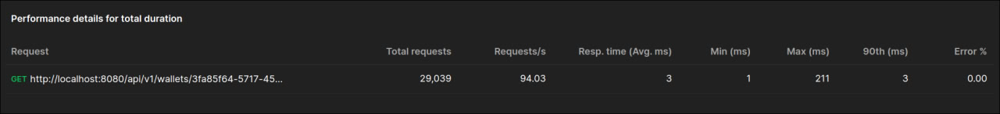
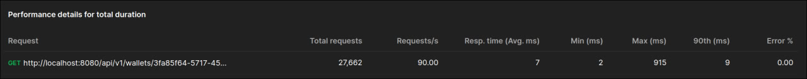

# test-task-wallet

## Запуск приложения
1. Отредактировать config.env в коре проекта(читать раздел config.env)
2. 
```bash 
    docker compose --env-file=config.env up --build
```
---

## config.env

**SERVER_VERSION**=1 - версия приложения, вляет на путь запросов к серверу

**SERVER_PORT_HTTP**=8080 - порт для http сервера

-
**LOGGER_MOD**=production - отвечает за режим работы логов, может быть **debug/production**

-
**POSTGRES_DB**=test - отвечает за название базы данных

**POSTGRES_PASSWORD**=test - отвечает за пароль к базе данных

**POSTGRES_USER**=test - отвечает за имя пользователя для базы данных

**POSTGRES_VERSION**=17.0 - отвечает за версию postgres, которая будет использоваться в контейнере

**POSTGRES_PORT**=4545 - отвечает за внешний порт работы postgres

**POSTGRES_HOST**=localhost - отвечает за внешний хост базы данных

**POSTGRES_MIN_CONN**=20 - отвечает за минимальное количество подключений к базе данных

**POSTGRES_MAX_CONN**=80  - отвечает за максимальное количество подключений к базе данных

-
**REDIS_PORT**=6370 - отвечет за внешний порт работы redis

**REDIS_HOST**=localhost - отвечает за внешний хост redis

**REDIS_VERSION**=alpine3.19 - отвечает за версию redis, которая будет использоваться в контейнере

---

## Особенности
- В приложении используется кэширование запросов,
    для этого используется redis(настроенно на 10сек), который запускается в контейнере, 
    чтоб получить актуальную информацию используй header `Cache-Control: no-cache` в запросах

---

## Тесты
Для запуска тестов необходимо выполнить команду 
```bash 

go test -v ./... 
```

---

## Документация
Документация по API доступна по адресу: /api/vX/swagger/index.html где X это версия приложения

---

## Технологии
- Goland
- Redis
- Postgres

---

## Производительность

Для тестирования производительности используется Postman, нагрузочное тестирование 5 минут и 100 workers
Результаты тестирования:
- **GET /api/vX/wallets/{WALLET_ID}** с кэшированием



- **GET /api/vX/wallets/{WALLET_ID}** без кэширования
